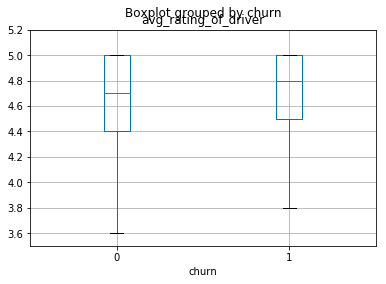

# Ridesharing Churn Analysis
## Alex Cross, Scott Peabody, Daniel Reiff, Alex Rook
### Background and Motivation
#### We picked the churn dataset because we viewed this as being slightly dirtier and a bit more interesting project.
### Process
We adopted a divide and divide and conquer approach. With two of us getting a feel for the data and the other two developing a set a generalized set of models.
The data was mostly clean, with a few expectations.
- We had a few results where there was no phone identified. We elected to not drop those as they represented a small proportion of the overall dataset but instead encoded them as a separate category.
- Didn't use the last ride date as that would have resulted in leakage
- We needed to tranform the date into a usable form
- Outliers: There were a couple of features that seemed to have outliers in the data. We tried removing these outliers from the training set, but it did not improve the results.

## EDA

## The Modeling Process

- Modeling We created a class that was capable of training on a variety of models. Hyperparameters were tuned with a random CV search.

- Separately, we also trained a neural network. Results were similar to the other models

### Analysis & Results

 - Boosting, Forests, and Logit

 - MLP
 

tuned with a RandomizedCV search which searches over a fixed number of parameters determined by a number of iterations. We used 20 iterations.
### Commentary
Accuracy is worse than precision and recall because there are more true positives than true negatives
### Lesson's Learned

Message Alex Rook, Daniel Reiff, Alex Cross

Files

